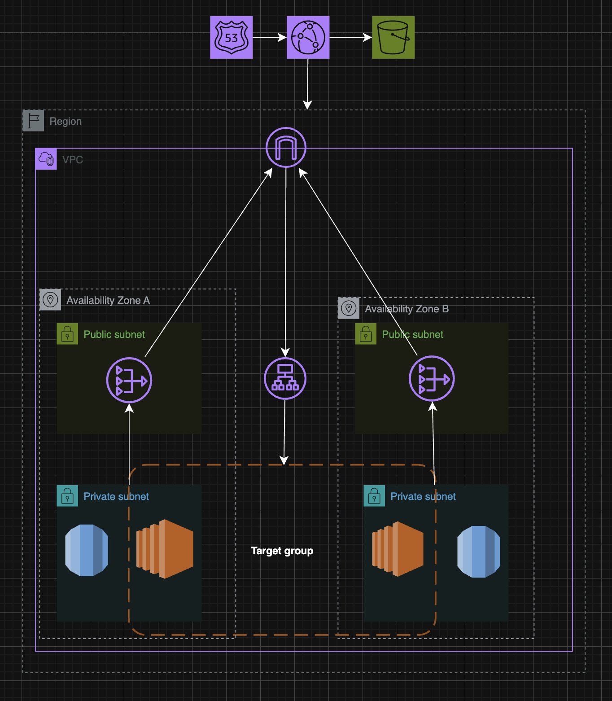

# WordPress on AWS - ClickOps Deployment

A hands-on demonstration of deploying WordPress on AWS using the AWS Console (point-and-click operations).

## What I Built

Deployed a complete WordPress application on AWS with proper networking, security, and scalability using only the AWS Console.

## Architecture

## AWS Services Used

- **Route 53**: DNS routing to CloudFront
- **CloudFront**: Global CDN for static and dynamic content
- **ALB**: Load balancer distributing traffic to EC2
- **EC2**: WordPress server in private subnet
- **RDS**: MySQL database for WordPress data
- **S3**: Scalable storage for media uploads
- **VPC**: Public/private subnets with security groups
- **NAT Gateway**: Outbound internet access for EC2
- **VPC Endpoints**: Secure Systems Manager access
- **IAM Roles**: EC2 permissions for S3 and Systems Manager

## Key Features

- Security: EC2 in private subnet, access via Systems Manager Session Manager  
- Scalability: CloudFront caches globally, S3 for unlimited media storage  
- Managed DB: RDS handles backups and maintenance  
- Traffic Distribution: ALB with health checks  
- CDN Integration: CloudFront routes static content to S3, dynamic to ALB  

## How I Set This Up

All configuration done via **AWS Console ClickOps** (no infrastructure-as-code, no CLI):

1. Created VPC with public/private subnets
2. Set up security groups with proper firewall rules
3. Launched RDS MySQL database
4. Created Application Load Balancer with target group
5. Launched EC2 instance with WordPress via Session Manager
6. Created S3 bucket for media uploads
7. Deployed CloudFront distribution with 2 origins and behaviors
8. Configured Route 53 to point domain to CloudFront
9. Set up VPC Endpoints for secure AWS service access

## Results

- WordPress running at `eiddev.xyz`
- Global content delivery via CloudFront
- Secure architecture with private EC2
- Scalable storage with S3
- Managed database with RDS

## What I Learned

Understanding how AWS services interconnect, network security, load balancing, CDN caching, managed databases, and IAM permissions through hands-on deployment.

## Screenshots

See `/screenshots` folder for AWS Console configurations.
