# WordPress on AWS - Step-by-Step ClickOps Setup

Complete guide on how I deployed WordPress on AWS using the AWS Console. This allowed me to have better understanding of AWS configurations.

---

## Phase 1: VPC & Networking Setup

### Step 1: Create VPC

1. Go to **VPC** → **VPCs**
2. Click **Create VPC**
   - Name: `wordpress-vpc`
   - IPv4 CIDR: `10.0.0.0/16`
3. Click **Create VPC**

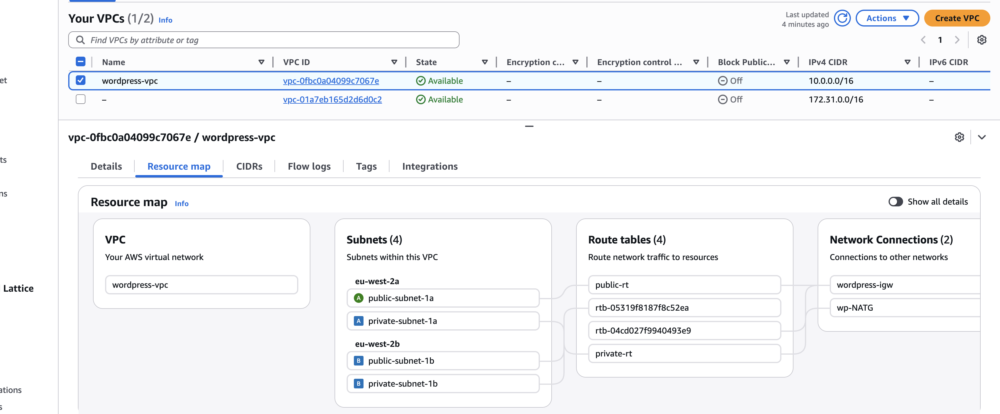

### Step 2: Create Internet Gateway

1. Go to **VPC** → **Internet Gateways**
2. Click **Create internet gateway**
   - Name: `wordpress-igw`
3. Click **Create**
4. Select IGW → **Attach to VPC** → Select `wordpress-vpc`

### Step 3: Create Public Subnet

1. Go to **VPC** → **Subnets**
2. Click **Create subnet**
   - VPC: `wordpress-vpc`
   - Name: `public-subnet-1a`
   - AZ: `eu-west-2a`
   - IPv4 CIDR: `10.0.1.0/24`
3. Click **Create subnet**

### Step 4: Create Private Subnet

1. Click **Create subnet**
   - VPC: `wordpress-vpc`
   - Name: `private-subnet-1a`
   - AZ: `eu-west-2a`
   - IPv4 CIDR: `10.0.2.0/24`
2. Click **Create subnet**

### Step 5: Enable Auto-assign Public IP

1. Select `public-subnet-1a`
2. **Actions** → **Edit subnet settings**
3. Check **Enable auto-assign public IPv4 address**
4. Click **Save**

### Step 6: Create NAT Gateway

1. Go to **VPC** → **NAT Gateways**
2. Click **Create NAT Gateway**
   - Subnet: `public-subnet-1a`
   - Elastic IP: Click **Allocate Elastic IP**
3. Click **Create NAT Gateway**

### Step 7: Create Route Tables

**Public Route Table:**
1. Go to **VPC** → **Route Tables**
2. Click **Create route table**
   - Name: `public-rt`
   - VPC: `wordpress-vpc`
3. Click **Create**
4. Select it → **Routes** → **Edit routes**
5. **Add route**: Destination `0.0.0.0/0`, Target: IGW
6. Go to **Subnet associations** → Associate `public-subnet-1a`

**Private Route Table:**
1. Click **Create route table**
   - Name: `private-rt`
   - VPC: `wordpress-vpc`
2. Click **Create**
3. Select it → **Routes** → **Edit routes**
4. **Add route**: Destination `0.0.0.0/0`, Target: NAT Gateway
5. Go to **Subnet associations** → Associate `private-subnet-1a`

---

## Phase 2: Security Groups

### Step 8: Create ALB Security Group

1. Go to **EC2** → **Security Groups**
2. Click **Create security group**
   - Name: `alb-sg`
   - VPC: `wordpress-vpc`
3. **Inbound rules**:
   - HTTP (80) from `0.0.0.0/0`
   - HTTPS (443) from `0.0.0.0/0`
4. Click **Create security group**

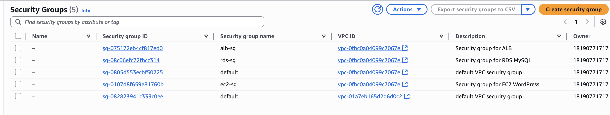

### Step 9: Create EC2 Security Group

1. Click **Create security group**
   - Name: `ec2-sg`
   - VPC: `wordpress-vpc`
2. **Inbound rules**:
   - HTTP (80) from `alb-sg`
   - HTTPS (443) from `alb-sg`
   - SSH (22) from your IP (optional)
3. Click **Create security group**

### Step 10: Create RDS Security Group

1. Click **Create security group**
   - Name: `rds-sg`
   - VPC: `wordpress-vpc`
2. **Inbound rules**:
   - MySQL (3306) from `ec2-sg`
3. Click **Create security group**

---

## Phase 3: RDS Database

### Step 11: Create RDS Subnet Group

1. Go to **RDS** → **Subnet groups**
2. Click **Create DB subnet group**
   - Name: `wordpress-subnet-group`
   - VPC: `wordpress-vpc`
3. Add both subnets: `public-subnet-1a` and `private-subnet-1a`
4. Click **Create**

### Step 12: Create RDS Database

1. Go to **RDS** → **Databases**
2. Click **Create database**
   - Engine: **MySQL 8.0**
   - Template: **Dev/Test**
   - DB identifier: `wordpress-db`
   - Master username: `admin`
   - Master password: Create strong password
   - Instance class: `db.t3.micro`
   - Storage: `20 GB`
   - VPC: `wordpress-vpc`
   - DB subnet group: `wordpress-subnet-group`
   - Publicly accessible: **No**
   - VPC security group: `rds-sg`
   - Initial database name: Leave blank
3. Click **Create database**

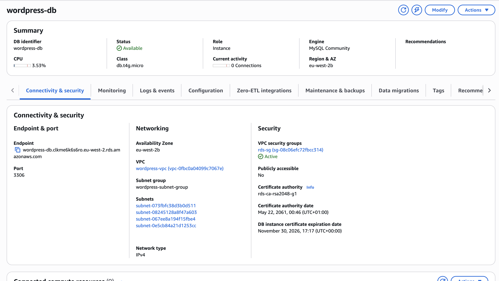

---

## Phase 4: Application Load Balancer

### Step 13: Create ALB

1. Go to **EC2** → **Load Balancers**
2. Click **Create load balancer** → **Application Load Balancer**
   - Name: `wordpress-alb`
   - VPC: `wordpress-vpc`
   - Subnets: `public-subnet-1a`
   - Security group: `alb-sg`
3. Click **Next**

### Step 14: Create Target Group

1. Create new target group:
   - Name: `wordpress-tg`
   - Protocol: **HTTP**
   - Port: **80**
   - VPC: `wordpress-vpc`
2. Click **Next** → **Create target group**
3. Click **Create load balancer**

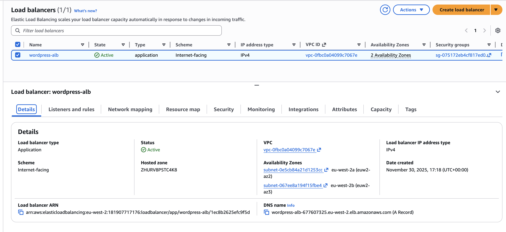

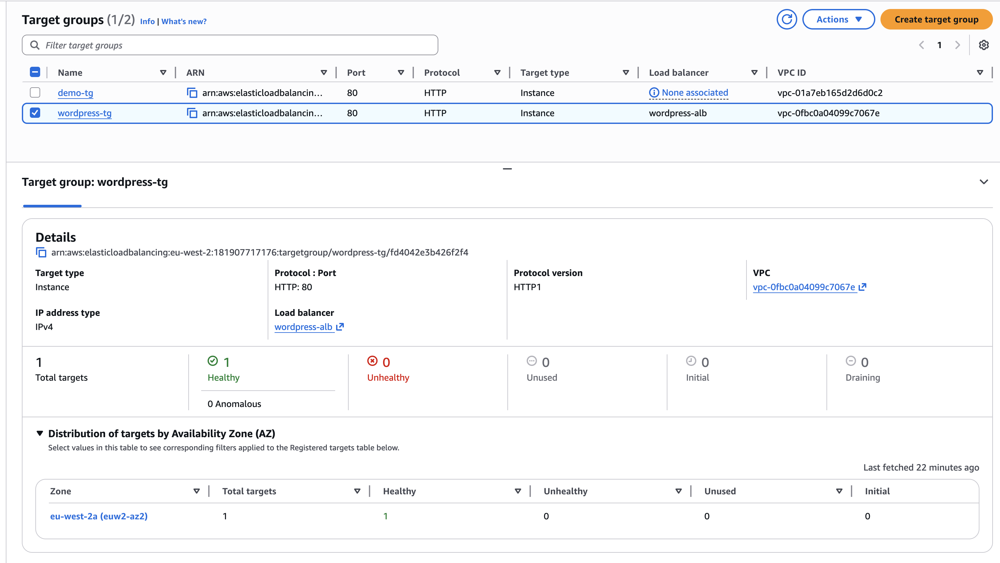

---

## Phase 5: EC2 Instance

### Step 15: Create IAM Role

1. Go to **IAM** → **Roles**
2. Click **Create role**
   - Service: **EC2**
3. Add policies:
   - `AmazonS3FullAccess`
   - `AmazonSSMManagedInstanceCore`
4. Role name: `wordpress-ec2-role`
5. Click **Create role**

### Step 16: Launch EC2 Instance

1. Go to **EC2** → **Instances**
2. Click **Launch instances**
   - Name: `wordpress-server-1`
   - AMI: **Amazon Linux 2**
   - Instance type: **t2.micro**
   - VPC: `wordpress-vpc`
   - Subnet: `private-subnet-1a`
   - IAM instance profile: `wordpress-ec2-role`
   - Security group: `ec2-sg`
   - Storage: `30 GB` (gp3)
3. Click **Launch instances**

### Step 17: Register with Target Group

1. Go to **EC2** → **Target Groups**
2. Select `wordpress-tg`
3. Go to **Targets** tab
4. Click **Register targets**
5. Select your EC2 instance
6. Click **Register targets**

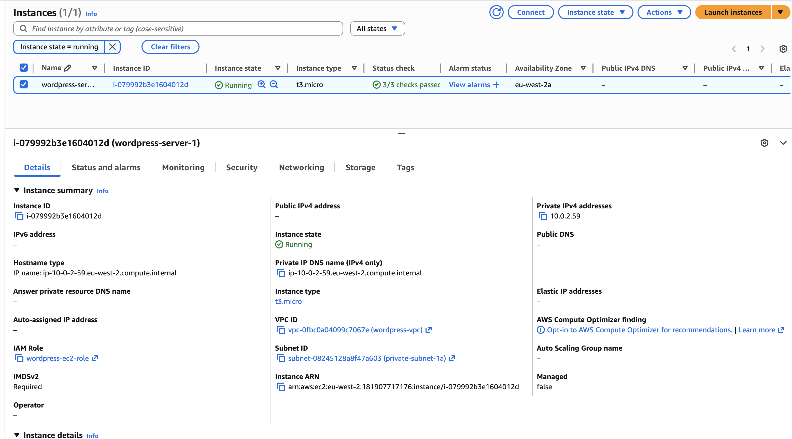

---

## Phase 6: Install WordPress

### Step 18: Connect via Session Manager

1. Go to **EC2** → **Instances**
2. Select your instance
3. Click **Connect** → **Session Manager** → **Connect**

### Step 19: Install Apache & PHP

```bash
sudo yum update -y
sudo yum install -y httpd php php-pdo php-mysqli php-gd php-mbstring php-xml
sudo systemctl start httpd
sudo systemctl enable httpd
```

### Step 20: Install WordPress

```bash
cd /var/www/html
sudo wget https://wordpress.org/latest.tar.gz
sudo tar -xzf latest.tar.gz
sudo mv wordpress/* .
sudo rmdir wordpress
sudo rm latest.tar.gz
sudo chown -R apache:apache /var/www/html
sudo chmod -R 755 /var/www/html
```

### Step 21: Configure WordPress

```bash
sudo cp wp-config-sample.php wp-config.php
sudo nano wp-config.php
```

Update these lines with your RDS endpoint and credentials:
```php
define('DB_NAME', 'wordpress');
define('DB_USER', 'admin');
define('DB_PASSWORD', 'YOUR_PASSWORD');
define('DB_HOST', 'YOUR_RDS_ENDPOINT:3306');
```

### Step 22: Create WordPress Database

```bash
sudo amazon-linux-extras install -y mysql8.0
php -r "
\$mysqli = new mysqli('YOUR_RDS_ENDPOINT', 'admin', 'YOUR_PASSWORD');
if (\$mysqli->connect_error) {
    die('Connection failed: ' . \$mysqli->connect_error);
}
\$mysqli->query('CREATE DATABASE IF NOT EXISTS wordpress');
echo 'Database created successfully';
\$mysqli->close();
"
sudo systemctl restart httpd
```

---

## Phase 7: S3 Bucket

### Step 23: Create S3 Bucket

1. Go to **S3** → **Buckets**
2. Click **Create bucket**
   - Name: `wordpress-media-YOUR-ID` (must be unique)
   - Region: `eu-west-2`
3. Click **Create bucket**

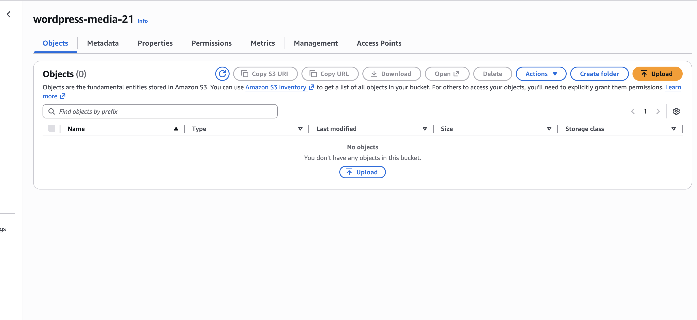

---

## Phase 8: VPC Endpoints

### Step 24: Enable DNS Support

1. Go to **VPC** → **Your VPCs**
2. Select `wordpress-vpc`
3. **Actions** → **Edit VPC settings**
4. Check:
   - Enable DNS hostnames
   - Enable DNS resolution
5. Click **Save**

### Step 25: Create VPC Endpoints

**SSM Endpoint:**
1. Go to **VPC** → **Endpoints**
2. Click **Create endpoint**
   - Service name: `com.amazonaws.eu-west-2.ssm`
   - VPC: `wordpress-vpc`
   - Subnets: `private-subnet-1a`
   - Security group: `ec2-sg`
3. Click **Create endpoint**

**SSM Messages Endpoint:**
1. Repeat with service name: `com.amazonaws.eu-west-2.ssmmessages`

**EC2 Messages Endpoint:**
1. Repeat with service name: `com.amazonaws.eu-west-2.ec2messages`

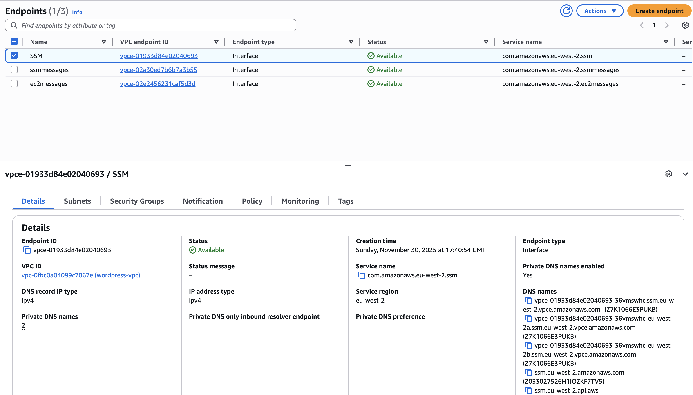

---

## Phase 9: CloudFront Distribution

### Step 26: Create CloudFront Distribution

1. Go to **CloudFront** → **Distributions**
2. Click **Create distribution**
3. **Origins**:
   - Origin 1: ALB domain (`wordpress-alb-xxx.eu-west-2.elb.amazonaws.com`)
   - Origin 2: S3 bucket domain
4. **Behaviors**:
   - Default (*) → ALB origin
   - Path pattern `/wp-content/uploads/*` → S3 origin
5. **Viewer protocol policy**: HTTP and HTTPS
6. **Allowed HTTP methods**: GET, HEAD, OPTIONS, PUT, POST, PATCH, DELETE
7. Click **Create distribution**

Wait for deployment (5-10 minutes).

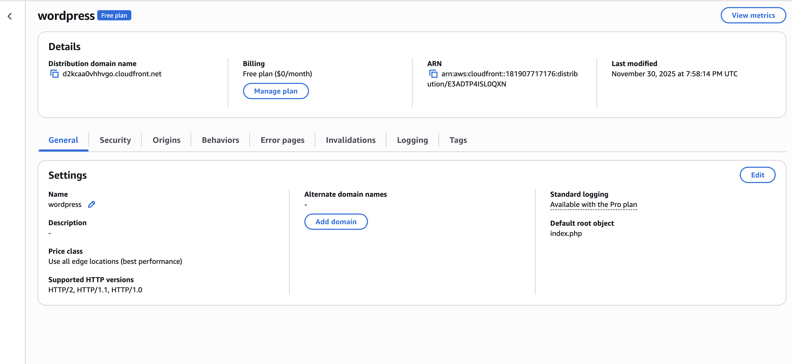

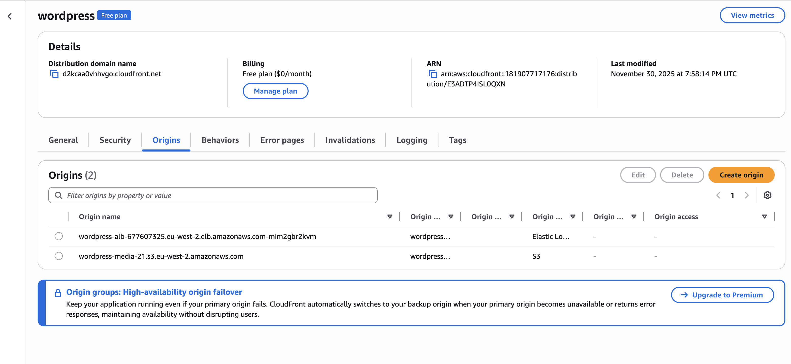

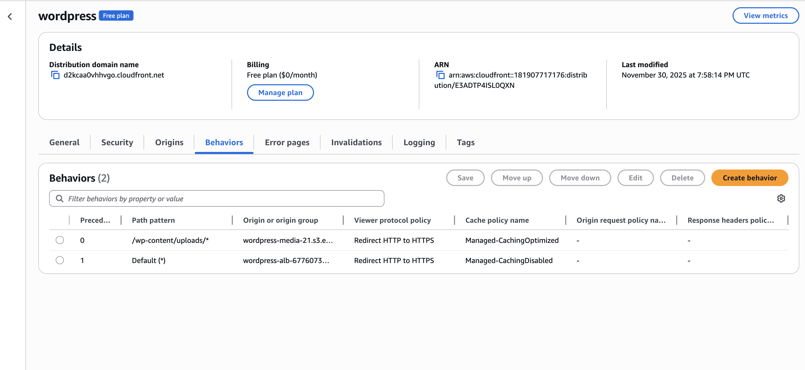

---

## Phase 10: Route 53 DNS

### Step 27: Create Route 53 Record

1. Go to **Route 53** → **Hosted zones**
2. Select your domain
3. Click **Create record**
   - Type: **A**
   - Alias: **Yes**
   - Alias target: Select CloudFront distribution
4. Click **Create records**

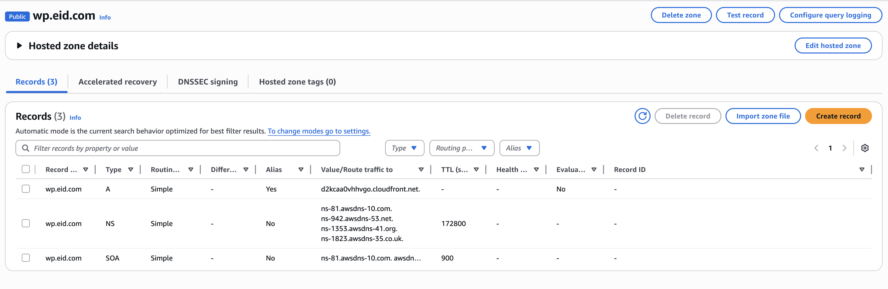

---

## Testing

1. **CloudFront domain works**: `http://d2kcaa0vhhvgo.cloudfront.net`
2. **Domain works**: `http://eiddev.xyz` (after DNS propagates 24-48 hours)
3. **WordPress Setup**: Complete the WordPress installation wizard
4. **Admin Dashboard**: `https://eiddev.xyz/wp-admin`

---

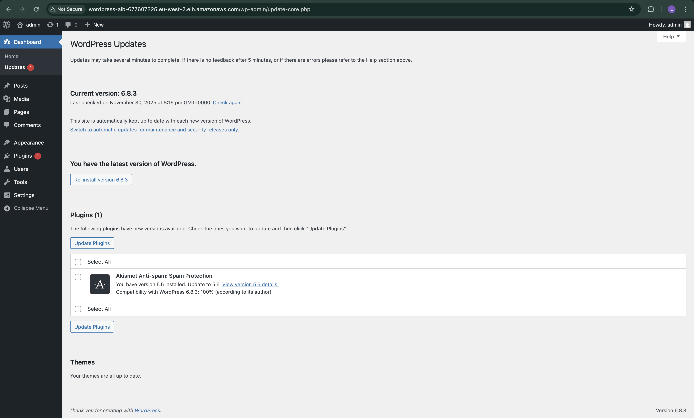

 WordPress application is now deployed on AWS with proper networking, security, and scalability.
